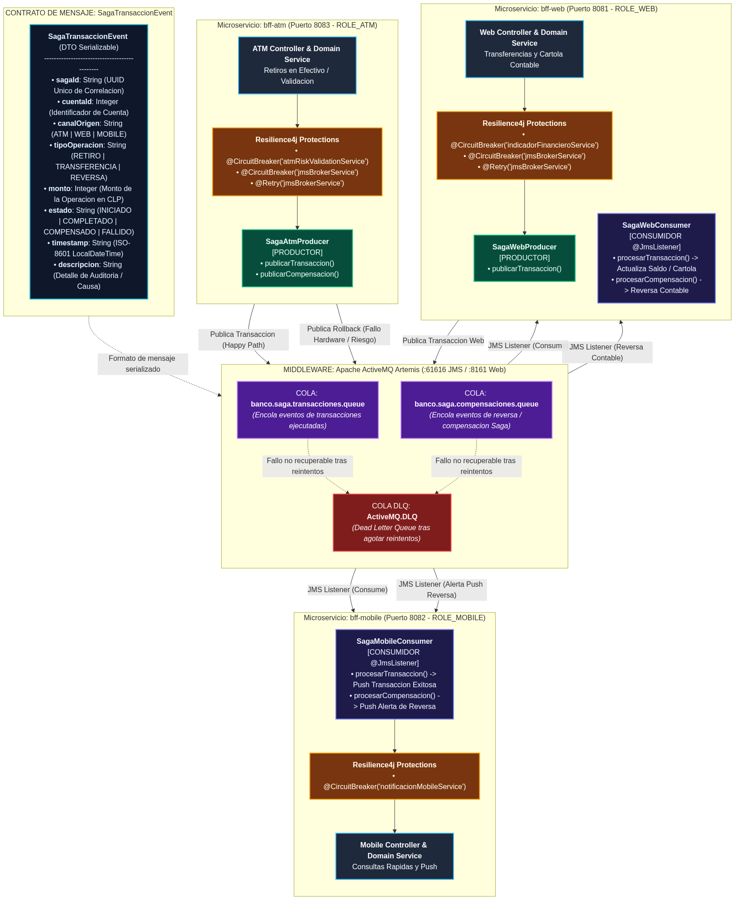
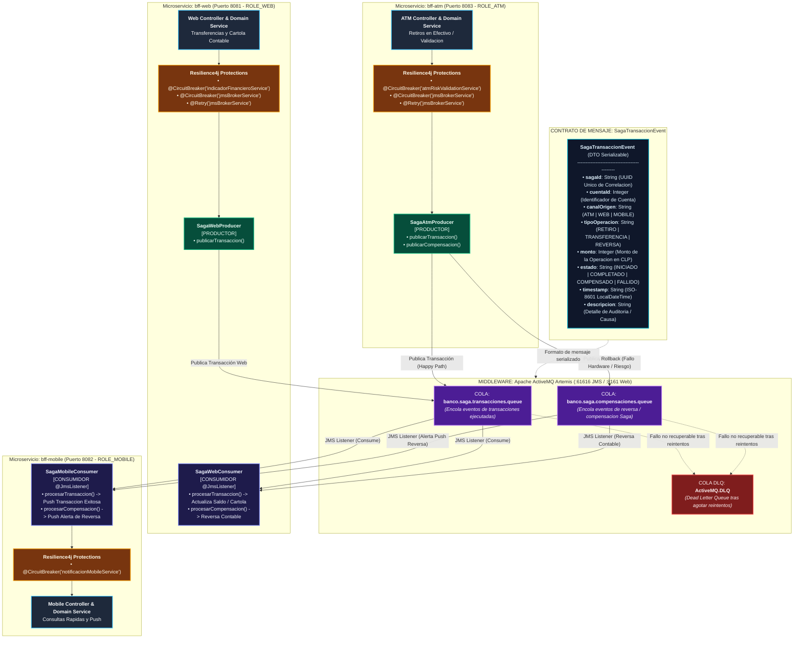

# Ecosistema Bancario de Microservicios BFF

Arquitectura de microservicios bancarios en la nube desarrollada con **Spring Boot 3.4.1**, **Spring Cloud 2024.0.0**, **Apache ActiveMQ Artemis (Docker)**, **Resilience4j** y **Spring Security (JWT)**.

---

## 1. Servicios y Puertos

| Componente | Puerto | Tipo | Función Principal | Credenciales / Acceso |
| :--- | :--- | :--- | :--- | :--- |
| **ActiveMQ Artemis** | `61616` / `8161` | Middleware | Broker JMS Jakarta EE & Dashboard de Colas | `admin` / `admin` |
| **Config Server** | `8888` | Infraestructura | Repositorio Central de Configuración (`config-repo/`) | Público |
| **Eureka Server** | `8761` | Infraestructura | Service Discovery & Health Dashboard | [http://localhost:8761](http://localhost:8761) |
| **bff-web** | `8081` | Microservicio | Canal Web, Libro Mayor contable y valorización USD | `ROLE_WEB` |
| **bff-mobile** | `8082` | Microservicio | Canal Móvil y despacho de Notificaciones Push | `ROLE_MOBILE` |
| **bff-atm** | `8083` | Microservicio | Canal Cajero, Retiros y Productor Saga con Compensación | `ROLE_ATM` |

---

## 2. Arquitectura de Eventos y Patrón Saga (ActiveMQ Artemis & Resilience4j)



### Diagrama Mermaid de Arquitectura de Eventos

> [!NOTE]
> Archivo fuente disponible en [`docs/arquitectura-eventos.mmd`](docs/arquitectura-eventos.mmd) y renderizado estático en [`docs/arquitectura-eventos.png`](docs/arquitectura-eventos.png).



### Detalle de Componentes de la Arquitectura de Eventos

#### A. Colas de Mensajería (ActiveMQ Artemis)
| Cola / Destino | Propósito | Productores | Consumidores |
| :--- | :--- | :--- | :--- |
| `banco.saga.transacciones.queue` | Eventos de transacciones exitosas (Retiros ATM, Transferencias Web). | `bff-atm` (`SagaAtmProducer`), `bff-web` (`SagaWebProducer`) | `bff-web` (`SagaWebConsumer`), `bff-mobile` (`SagaMobileConsumer`) |
| `banco.saga.compensaciones.queue` | Eventos de compensación / reversa automática por fallo transaccional (ej: atasco en dispensador ATM). | `bff-atm` (`SagaAtmProducer`) | `bff-web` (Reversa contable en base de datos), `bff-mobile` (Push de alerta de seguridad) |
| `ActiveMQ.DLQ` | Dead Letter Queue para almacenamiento de mensajes irrecuperables tras reintentos fallidos. | ActiveMQ Artemis Broker (automático) | Operaciones / Auditoría |

#### B. Contrato del Evento (`SagaTransaccionEvent`)
Todos los mensajes intercambiados a través del broker implementan el DTO `SagaTransaccionEvent`:
- `sagaId` (`String`): Identificador único universal (UUID) de la saga para rastreo distribuido.
- `cuentaId` (`Integer`): Identificador de la cuenta bancaria afectada.
- `canalOrigen` (`String`): Canal que originó el evento (`"ATM"`, `"WEB"`, `"MOBILE"`).
- `tipoOperacion` (`String`): Tipo de acción ejecutada (`"RETIRO"`, `"TRANSFERENCIA"`, `"REVERSA"`).
- `monto` (`Integer`): Monto de la operación en pesos chilenos (CLP).
- `estado` (`String`): Estado actual del ciclo de vida (`"INICIADO"`, `"COMPLETADO"`, `"COMPENSADO"`, `"FALLIDO"`).
- `timestamp` (`String`): Marca temporal en formato ISO-8601 (`LocalDateTime.now().toString()`).
- `descripcion` (`String`): Detalle explicativo, causa de reversa o motivo de fallo para auditoría.

#### C. Aplicación de Tolerancia a Fallos (Resilience4j)
| Microservicio | Componente / Clase | Anotaciones Resilience4j | Mecanismo y Fallback |
| :--- | :--- | :--- | :--- |
| **`bff-atm`** | `SagaAtmProducer` | `@CircuitBreaker(name = "jmsBrokerService")`<br/>`@Retry(name = "jmsBrokerService")` | Evita saturar el broker JMS si está caído; fallback registra advertencia y preserva consistencia. Reintenta hasta 3 veces con backoff. |
| **`bff-atm`** | `AtmRiskValidationService` | `@CircuitBreaker(name = "atmRiskValidationService")` | Protege contra lentitud o fallos en motores antifraude externos; fallback permite operación controlada bajo límite de seguridad. |
| **`bff-web`** | `SagaWebProducer` | `@CircuitBreaker(name = "jmsBrokerService")`<br/>`@Retry(name = "jmsBrokerService")` | Protege publicación de eventos transaccionales web ante indisponibilidad del middleware. |
| **`bff-web`** | `IndicadorFinancieroService` | `@CircuitBreaker(name = "indicadorFinancieroService")` | Protege contra fallos en API externa de divisas (mindicador.cl); fallback retorna último valor dólar en caché. |
| **`bff-mobile`**| `NotificacionMobileService` | `@CircuitBreaker(name = "notificacionMobileService")` | Aísla caídas del proveedor Push (Firebase/APNs); fallback guarda notificación en cola diferida local. |

---

## 3. Instrucciones de Arranque

### Paso 1: Compilación
```bash
mvn clean compile
```

### Paso 2: Iniciar Broker ActiveMQ (Docker Desktop)
```bash
docker compose up -d
```
*Consola Web:* [http://localhost:8161/console](http://localhost:8161/console) (Usuario: `admin`, Contraseña: `admin`).

### Paso 3: Iniciar Microservicios (en terminales separadas y en este orden)
```bash
# Terminal 1: Servidor de Configuración
cd config-server && mvn spring-boot:run

# Terminal 2: Servidor Eureka (esperar a que suba y validar en http://localhost:8761)
cd eureka-server && mvn spring-boot:run

# Terminal 3: Canal Web
cd bff-web && mvn spring-boot:run

# Terminal 4: Canal Móvil
cd bff-mobile && mvn spring-boot:run

# Terminal 5: Canal Cajero
cd bff-atm && mvn spring-boot:run
```

---

## 4. Guía de Pruebas de Criterios

### A. Registro en Eureka y Config Server
```bash
# Validar los 3 microservicios con estado UP en Eureka:
curl -s -H "Accept: application/json" http://localhost:8761/eureka/apps

# Validar inyección centralizada de propiedades:
curl -s http://localhost:8888/bff-web/default
```

### B. Patrón Saga con ActiveMQ Artemis (Transacción y Compensación)
```bash
# 1. Escenario Exitoso (Happy Path):
# ATM debita localmente -> publica en ActiveMQ -> Web sincroniza cartola -> Mobile envía push
curl -s "http://localhost:8083/api/atm/public/saga-retiro/test?cuentaId=1&monto=30000&fail=false"

# 2. Escenario de Compensación (Rollback automático ante falla):
# Falla simulada en dispensador -> revierte saldo en MySQL -> publica reversa en ActiveMQ -> notifica a Web y Mobile
curl -s "http://localhost:8083/api/atm/public/saga-retiro/test?cuentaId=1&monto=30000&fail=true"
```

### C. Tolerancia a Fallos con Resilience4j (Circuit Breaker & Fallback)
```bash
# Llamada normal (Circuito CLOSED):
curl -s "http://localhost:8081/api/web/public/circuit-breaker/test?cuentaId=1&fail=false"

# Forzar caída de dependencia externa (Activa Fallback):
curl -s "http://localhost:8081/api/web/public/circuit-breaker/test?cuentaId=1&fail=true"

# Monitoreo de estado en Actuator:
curl -s http://localhost:8081/actuator/circuitbreakers
```

### D. Seguridad (Spring Security & JWT)
```bash
# 1. Generar Token JWT para Canal Web:
curl -s "http://localhost:8081/api/auth/token?usuario=profesor&rol=ROLE_WEB"

# 2. Petición Autorizada con Token (200 OK):
curl -i -H "Authorization: Bearer <TOKEN_WEB>" "http://localhost:8081/api/web/cuentas/1/indicadores"

# 3. Petición Rechazada sin Token (401 Unauthorized):
curl -i "http://localhost:8081/api/web/cuentas/1/indicadores"

# 4. Petición Rechazada por Rol Incorrecto RBAC (403 Forbidden):
curl -s "http://localhost:8081/api/auth/token?usuario=profesor&rol=ROLE_ATM"
curl -i -H "Authorization: Bearer <TOKEN_ATM>" "http://localhost:8081/api/web/cuentas/1/indicadores"
```
